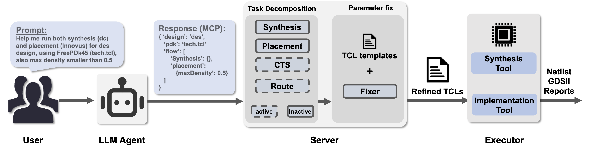
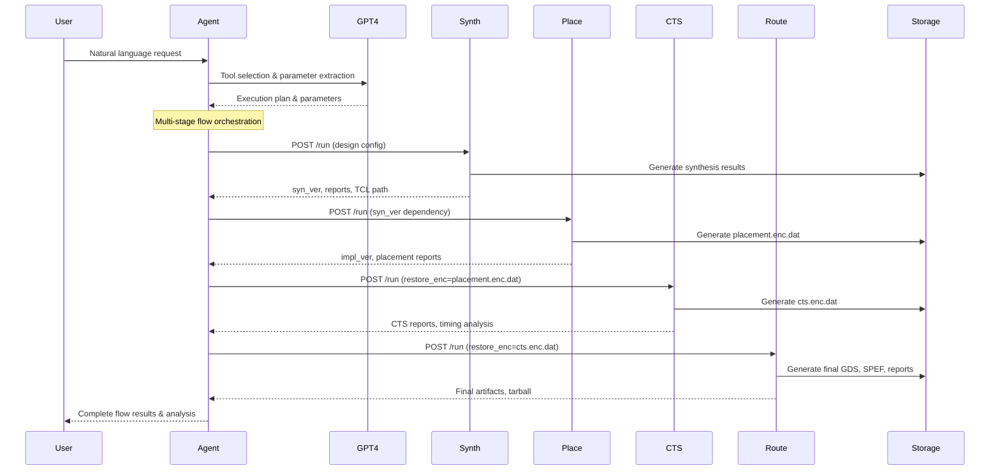

# AutoEDA: Enabling EDA Flow Automation through Microservice-Based LLM Agents

[](https://www.python.org/downloads/)
[](https://fastapi.tiangolo.com/)

A production-grade, microservice-based Electronic Design Automation (EDA) platform that transforms natural language instructions into complete RTL-to-GDSII flows. Built with AI-powered orchestration and commercial EDA tool integration.

---


## Overview

MCP-EDA revolutionizes chip design workflows by providing:

- **AI-Powered Orchestration**: GPT-4 driven intelligent agent that understands natural language design requirements
- **Microservice Architecture**: Four independent, stateless FastAPI services for complete EDA flow
- **Template-Driven TCL Generation**: Automated script generation from modular templates
- **Session-Aware Workflows**: Context preservation across multi-stage design flows
- **Research Framework**: Built-in experiment and evaluation capabilities with CodeBLEU metrics

---

## System Architecture
<p align="center">
    
</p>


### Service Architecture Details

| Service | Port | Purpose | Key Features |
|---------|------|---------|--------------|
| **Intelligent Agent** | 8000 | AI orchestration & workflow management | GPT-4 integration, session management, conflict detection |
| **Synthesis Service** | 18001 | RTL-to-gate synthesis | Template-driven TCL, Design Compiler integration |
| **Placement Service** | 18002 | Floorplan + Powerplan + Placement | Multi-stage unified flow, workspace management |
| **CTS Service** | 18003 | Clock tree synthesis | Post-placement optimization, timing-driven CTS |
| **Routing Service** | 18004 | Global/detail routing + final save | Complete backend flow, artifact generation |

### Data Flow Architecture



---

## Key Features

### AI-Powered Workflow Management
- **Natural Language Processing**: Convert design requirements to EDA parameters
- **Intelligent Tool Selection**: Automatic flow stage determination
- **Conflict Detection**: Identify and resolve parameter conflicts
- **Strategy Optimization**: Performance, power, area, and speed optimization strategies

### Microservice Benefits
- **Independent Scaling**: Each service scales independently
- **Fault Isolation**: Service failures don't affect the entire flow
- **Technology Agnostic**: Easy integration with different EDA tools
- **Development Flexibility**: Teams can work on services independently

### Template System
```
src/scripts/FreePDK45/
├── tech.tcl                      # Technology configuration
├── frontend/                     # Synthesis templates
│   └── combined_synthesis.tcl    # Complete synthesis flow
└── backend/                      # Physical design templates
    ├── combined_placement.tcl    # Floorplan + power planning + placement
    ├── combined_cts.tcl          # Clock tree synthesis
    └── combined_routing.tcl      # Global/detailed routing + final save
```

### Session Management
- **Context Preservation**: Remember previous parameters and preferences
- **Parameter Inheritance**: Smart parameter reuse across flows
- **History Tracking**: Complete audit trail of design decisions
- **Preference Learning**: Adapt to user patterns over time

---

## Prerequisites

### System Requirements
| Component | Requirement | Notes |
|-----------|-------------|-------|
| **Operating System** | Linux x86-64 | Tested on RHEL 8, Ubuntu 20.04+ |
| **Python** | 3.9+ | See requirements.txt for dependencies |
| **Memory** | 16GB+ | Recommended for large designs |
| **Storage** | 100GB+ | For design databases and results |

### EDA Tools
| Tool | Version | Purpose |
|------|---------|---------|
| **Synopsys Design Compiler** | 2023.03+ | RTL synthesis |
| **Cadence Innovus** | 19.1+ or 22.1+ | Physical implementation |
| **Valid Licenses** | Required | Both tools need proper licensing |

---

## Installation

### 1. Clone Repository
```bash
git clone https://github.com/your-org/mcp-eda-example.git
cd mcp-eda-example
```

### 2. Python Environment Setup
```bash
# Create virtual environment
python3 -m venv venv
source venv/bin/activate

# Install dependencies
pip install -r requirements.txt
```

### 3. Configuration

#### **Environment Variables Setup**
```bash
# Required: OpenAI API Key
export OPENAI_API_KEY=your_openai_api_key_here

# Optional: Server Configuration
export MCP_SERVER_HOST=http://localhost
export LOG_ROOT=./logs
```

#### **Persistent Configuration (Recommended)**
```bash
# Add to your ~/.bashrc or ~/.zshrc for permanent setup
echo 'export OPENAI_API_KEY="your_openai_api_key_here"' >> ~/.bashrc
source ~/.bashrc

# Optional: Add EDA tools to PATH if needed
echo 'export PATH="/opt/synopsys/bin:/opt/cadence/bin:$PATH"' >> ~/.bashrc
```

### 4. EDA Tool Setup
Ensure EDA tools are properly installed and licensed:
```bash
# Verify Design Compiler
dc_shell -version

# Verify Innovus
innovus -version

# Check license servers
lmstat -a
```

---

## Quick Start

### 1. Environment Setup
```bash
# Activate virtual environment
source venv/bin/activate

# Verify OpenAI API key is set
echo "OpenAI API Key: ${OPENAI_API_KEY:0:10}..."
```

### 2. Start EDA Microservices
```bash
# Launch all 4 EDA microservices
python3 src/run_server.py --server all

# Or start individual servers
python3 src/run_server.py --server synthesis    # Port 18001
python3 src/run_server.py --server placement    # Port 18002
python3 src/run_server.py --server cts          # Port 18003
python3 src/run_server.py --server routing      # Port 18004

# Verify services are running
curl http://localhost:18001/docs  # Synthesis API docs
curl http://localhost:18002/docs  # Placement API docs
curl http://localhost:18003/docs  # CTS API docs
curl http://localhost:18003/docs  # Routing API docs
```

### 3. Start AI Agent
```bash
# Launch intelligent agent (interactive mode)
python3 src/mcp_agent_client.py

# Or run as web service
uvicorn src.mcp_agent_client:app --host 0.0.0.0 --port 8000 --reload
```

### 4. Run Your First Design
```bash
# Complete RTL-to-GDSII flow with natural language
curl -X POST http://localhost:8000/agent \
  -H "Content-Type: application/json" \
  -d '{
    "user_query": "Run complete flow for design des with high performance optimization",
    "session_id": "demo_session"
  }'

# Or use the simple client for testing
python3 src/simple_mcp_client.py
```

### 4. Alternative: Direct Service API
```bash
# Step 1: Synthesis
curl -X POST http://localhost:18001/run \
  -H "Content-Type: application/json" \
  -d '{
    "design": "aes",
    "tech": "FreePDK45",
    "clk_period": 5.0,
    "force": true
  }'

# Step 2: Placement (using synthesis results)
curl -X POST http://localhost:18002/run \
  -H "Content-Type: application/json" \
  -d '{
    "design": "aes",
    "tech": "FreePDK45",
    "syn_ver": "cpV1_clkP1_drcV1_20241201_143022",
    "target_util": 0.8,
    "force": true
  }'
```

---

## API Documentation

### Intelligent Agent API

#### POST `/agent`
Execute natural language EDA requests.

**Request:**
```json
{
  "user_query": "Run synthesis for design aes with 500MHz clock",
  "session_id": "optional_session_id"
}
```

**Response:**
```json
{
  "tool_called": "synth",
  "tool_input": {
    "design": "aes",
    "clk_period": 2.0,
    "tech": "FreePDK45"
  },
  "tool_output": {
    "status": "ok",
    "log_path": "/path/to/logs",
    "reports": {...}
  },
  "ai_reasoning": "Selected synthesis with 2ns period for 500MHz target",
  "suggestions": ["Consider power optimization after synthesis"]
}
```

#### GET `/session/{session_id}/history`
Retrieve session history and preferences.

### Service APIs

Each service provides OpenAPI documentation at `http://localhost:<port>/docs`:

- **Synthesis**: http://localhost:18001/docs
- **Placement**: http://localhost:18002/docs  
- **CTS**: http://localhost:18003/docs
- **Route & Save**: http://localhost:18003/docs

---

## Project Structure

```
mcp-eda-example/
├── src/                            # Source code directory
│   ├── server/                     # EDA microservices
│   │   ├── base_server.py          # Base server class
│   │   ├── synthesis_server.py     # Synthesis service
│   │   ├── placement_server.py     # Placement service  
│   │   ├── cts_server.py           # CTS service
│   │   ├── routing_server.py       # Routing service
│   │   ├── executor.py             # Executor class
│   │   └── mcp/                    # MCP server
│   │       ├── mcp_eda_server.py   # MCP server implementation
│   │       └── claude_desktop_config.json
│   ├── mcp_agent_client.py         # AI orchestration agent
│   ├── run_server.py               # Server launcher script
│   ├── scripts/                    # TCL templates
│   │   └── FreePDK45/              # Technology-specific scripts
│   │       ├── tech.tcl            # Technology configuration
│   │       ├── frontend/           # Synthesis templates
│   │       └── backend/            # Physical design templates
│   └── codebleu_tcl/               # CodeBLEU evaluation
├── designs/                        # Sample designs
│   ├── des/                        # DES crypto design
│   ├── b14/                        # b14 design
├── libraries/                      # PDK and libraries
├── logs/                           # Service logs
├── result/                         # Generated TCL scripts
├── deliverables/                   # Final artifacts
├── requirements.txt                # Python dependencies
└── README.md                       # This file
```

---

## TCL Code Quality Evaluation

The platform includes a specialized CodeBLEU-TCL evaluation framework for assessing TCL script quality in EDA workflows:

### CodeBLEU-TCL Framework

CodeBLEU-TCL is a domain-specific implementation of the CodeBLEU metric tailored for Electronic Design Automation TCL scripts. It provides:

- **EDA-Aware Evaluation**: Specialized weights for synthesis, placement, CTS, and routing stages
- **Domain-Specific Commands**: Recognition of 271+ EDA tool commands across the design flow
- **Advanced TCL Parsing**: Custom parser optimized for EDA script analysis
- **Multi-Dimensional Metrics**: Combines n-gram matching, syntax analysis, and dataflow analysis

### Basic Usage

```bash
cd src/codebleu_tcl

# Basic CodeBLEU evaluation
python3 -c "
from tcl_codebleu_evaluator import TCLCodeBLEUEvaluator
from pathlib import Path

evaluator = TCLCodeBLEUEvaluator()

# Example: Evaluate generated vs reference TCL
result = evaluator.evaluate_generated_tcl(
    generated_tcl_file=Path('generated_synth.tcl'),
    reference_tcl_file=Path('reference_synth.tcl'),
    tool_type='auto'  # Auto-detects: synthesis, placement, cts, routing
)

print(f'CodeBLEU Score: {result[\"summary\"][\"overall_score\"]:.2f}')
print(f'Tool Type: {result[\"file_info\"][\"detected_tool_type\"]}')
"
```

### Advanced Evaluation Features

```python
from codebleu.codebleu import calc_codebleu

# Example TCL scripts
reference = '''
set DESIGN_NAME chip_top
analyze -library WORK -format verilog {$DESIGN_NAME.v}
elaborate $DESIGN_NAME
compile_ultra -gate_clock
report_timing
'''

candidate = '''
set DESIGN_NAME chip_top
analyze -library WORK -format verilog {$DESIGN_NAME.v}
elaborate $DESIGN_NAME
compile_ultra -no_boundary_optimization
report_area
'''

# Calculate with EDA-specific weights
result = calc_codebleu([reference], [candidate], 'tcl')
print(f"CodeBLEU Score: {result['codebleu']:.2f}")
print(f"Syntax Match: {result['syntax_match_score']:.2f}")
print(f"Dataflow Match: {result['dataflow_match_score']:.2f}")
```

### Evaluation Metrics

The framework evaluates TCL code quality across four dimensions:

- **N-gram Match (BLEU)**: Traditional token-level similarity (0.0-1.0)
- **Weighted N-gram Match**: EDA keyword-aware scoring with domain-specific terms (0.0-1.0)
- **Syntax Match**: Structural analysis of TCL command hierarchies (0.0-1.0)
- **Dataflow Match**: Variable dependency and data flow analysis (0.0-1.0)

### EDA Stage-Specific Weights

Different EDA stages use optimized evaluation weights:

```python
eda_weights = {
    'synthesis': (0.20, 0.30, 0.25, 0.25),           # Emphasize weighted n-gram
    'unified_placement': (0.15, 0.25, 0.30, 0.30),   # Focus on syntax and dataflow
    'cts': (0.20, 0.25, 0.30, 0.25),                # Emphasize syntax structure
    'unified_route_save': (0.20, 0.25, 0.25, 0.30),  # Highlight dataflow connectivity
}
```

### Supported EDA Commands

The system recognizes 271+ domain-specific terms across:

- **Synthesis**: `analyze`, `elaborate`, `compile_ultra`, `create_clock`, `report_timing`
- **Placement**: `floorPlan`, `placeDesign`, `addStripe`, `globalNetConnect`
- **Clock Tree**: `ccopt_design`, `create_clock_tree_spec`, `report_ccopt_skew_groups`
- **Routing**: `routeDesign`, `setNanoRouteMode`, `saveDesign`, `streamOut`

---
## Advanced Configuration

### Custom EDA Tool Integration
```python
# In src/server/custom_tool_server.py
class CustomToolReq(BaseModel):
    design: str
    custom_param: float = 1.0

def generate_custom_tcl(req: CustomToolReq) -> str:
    # Your custom TCL generation logic
    return tcl_content

# Register in TOOLS dictionary
TOOLS["custom_tool"] = {"port": 18004, "path": "/run"}
```

### Template Customization
```tcl
# src/scripts/FreePDK45/backend/combined_placement.tcl
set custom_param $env(custom_param)

# Your custom EDA commands
customCommand -param $custom_param
```

### Strategy Development
```python
# In src/mcp_agent_client.py
STRATEGY_PARAMS["custom_strategy"] = {
    "design_flow_effort": "custom",
    "target_util": 0.75,
    "custom_param": 2.0
}
```

---

## Testing

### Unit Tests
```bash
# Run all tests
pytest tests/

# Run specific service tests
pytest tests/test_synth_server.py -v

# Run with coverage
pytest --cov=src/server tests/
```

### Integration Tests
```bash
# Test complete flow
python3 tests/integration/test_full_flow.py

# Test AI agent
python3 tests/integration/test_agent.py
```

### Load Testing
  ```bash
# Install load testing tools
pip install locust

# Run load tests
locust -f tests/load/test_agent_load.py --host=http://localhost:8000
```

---

## Monitoring and Observability

### Logging Configuration
```python
# Configure structured logging
import logging
import json

class JSONFormatter(logging.Formatter):
    def format(self, record):
        return json.dumps({
            'timestamp': self.formatTime(record),
            'level': record.levelname,
            'service': 'synth_server',
            'message': record.getMessage()
        })
```

### Health Checks
```bash
# Check service health
curl http://localhost:18001/health
curl http://localhost:8000/health

# Check all services
./scripts/health_check.sh
```

### Metrics Collection
```python
# Add Prometheus metrics
from prometheus_client import Counter, Histogram

request_count = Counter('requests_total', 'Total requests')
request_duration = Histogram('request_duration_seconds', 'Request duration')
```

---

## License

This project is licensed under the creative commons - see the [LICENSE](https://github.com/dukeceicenter/AutoEDA/blob/main/LICENSE.md) file for details.

---

## Acknowledgments

- **OpenAI** for GPT-4 API and AI capabilities
- **Synopsys** and **Cadence** for EDA tool integration
- **FreePDK45** community for the open-source PDK
- **FastAPI** and **Pydantic** for excellent web framework
- **Open-source EDA community** for inspiration and collaboration

---

## Support

- **Email**: yl996@duke.edu
- **Discussion**: [Join our discussion](https://github.com/dukeceicenter/AutoEDA/discussions)
- **Documentation**: [Quick Start Guide](https://github.com/dukeceicenter/AutoEDA/blob/main/QUICK_START_GUIDE.md)
- **Issues**: [GitHub Issues](https://github.com/dukeceicenter/AutoEDA/issues)

---

**Made with passion for the EDA and open-source community from Duke University**
